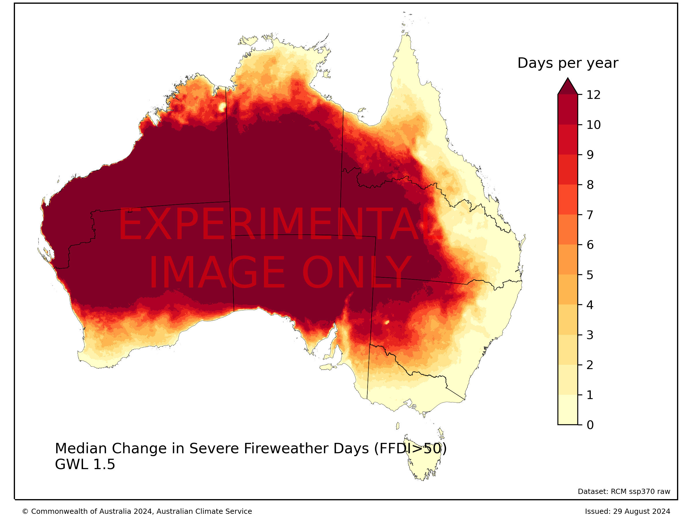

# hazard_fire

## Code and workflow 
Code and descriptions for fire weather indices and metrics

The initial code was developed to compute FFDI from the bias_input_data of the ACS regional climate simulations

FFDI is based on XCLIM implementation 

The code has been setup to process the data in bias-input-data for ssp370

To apply the code, one needs to
0. rechunk the simulations to store the data with all the time points in one chunk and save it into a Zarr store.  The chunking process required an initial time chunk of 1 because some of the files chunk only one-time point!  In future, it is recommended to chunk the netcdf files with smaller dimensions (e.g. time =-1, lat=33, lon=43) to facilitate the building of a dataset with one chunk in time.

See workflow repo for the catalogue create, rechunking and checking of the zarr store

The Zarr store should also speed up other diagnostics done along the time dimension (e.g. EHF)
**This step should be moved to the workflow repo for repeating the generation of the hazard diagnostics**

job_normal.sh can do steps 1 and 2

1. Compute the ffdi from the Zarr stores - 
ffdi_batch.ipynb (py) 
Note the XCLIM ffdi code cannot have chunking across the time dimension, hence the need for rechunking

2. Computes the number of days per year that ffdi exceeds 50, 75 and 100 for a set of GWLs. The output
can included average value, value for each year and the 20years of FFDI values for each GWL.  
ffdi_threshold_batch.ipynb  (py). 

3. threshold_stats - provide bring the information on the different thresholds together

3. ensemble-table provides stats on the ffdi thresholds for the different NCRA regions for the various RCMs and GWLs.  The routine writes a file for each threshold for all RCMs and GWLs, which can be used for future assessments.

4. Final step would be combined all these steps into one file to enable replication for different datasets.
PBS commands

for model 0 to 12 do 
	python rechunk,py model
	python ffdi_v0 model
done

## Simulations 

Initial calculations done on the unbiased corrected data that has been gridded on the AGCD grid.  

## Diagnostic FFDI

Bushfires are a complex hazard. The behaviour of fires, such as the rate of spread and intensity, are influenced by factors such as wind speed, temperature and humidity, past and recent rainfall, and fuel characteristics, such as the amount and how dry ('curing') the fuel is. The Forest Fire Danger Index was originally developed to help characterised fire spread in a forest environment trying to incorporate information on the weather into fire spread.  The FFDI calculated here provides a measure fire weather and it is a function of wind speed, temperature, humidity, past and recent rainfall.​  From FFDI, we have gone on to calculate the number of days FFDI is greater than 50,75 and 100 to provide a measure on how climate change will influence measure of extreme fire weather.   

The factors listed above will influence fire behaviour but do not guarantee ignition. Natural ignition sources include lightning, while human sources include electrical faults, downed power lines, sparks from power tools and deliberate ignition (arson). ​Further, the duration and intensity of a bushfire depends on the available fuel (type and condition), geographic features of the location such as aspect and slope, the ability of emergency services to reach and suppress the fire, background climatic conditions, and local weather conditions such as wind, temperature, and humidity. High-intensity bushfires in eucalypt and pine forests can spread via burning through tree canopies. This is known as ‘crowning’. ​

## Method 

The XCLIM software was used for the FFDI calculation and was done in the following steps using daily precipitation (pra), maximum temperature (tasmaxa), minimum humidity (hursmina) and maximum wind speed (fcWindmaxa), annual climatological rainfall (pra).

KBDI = keetch_byram_drought_index(pra, tasmaxa, pr_annual) 
DF = griffiths_drought_factor(pra, KBDI)
FFDI = mcarthur_forest_fire_danger_index(DF, tasmaxa, hursmina, sfcWindmaxa)

## Key Messages
### Background

The change in the annual number of days FFDI exceeds the 50, 75 and 100 from GWL1.2 are computed for each RCM simulation for each GWL.  The median value for the RCM simulations are shown below for FFDI annual days above 50. 

The median value for the RCM simulations are shown below for FFDI annual days above 75. 

## Insights for FFDI

##  Data/confidence ​

- Confidence: high confidence in the direction of change for extreme fire weather, medium confidence in the magnitude of change and low confidence in the consequence for bushfire risk because it is influenced by both extreme fire weather and fuel type and availability.
- Limitation: need to overlay extreme fire weather with fuel types.  There is no clear way to do this.  NBIC has also started working on this problem.​
